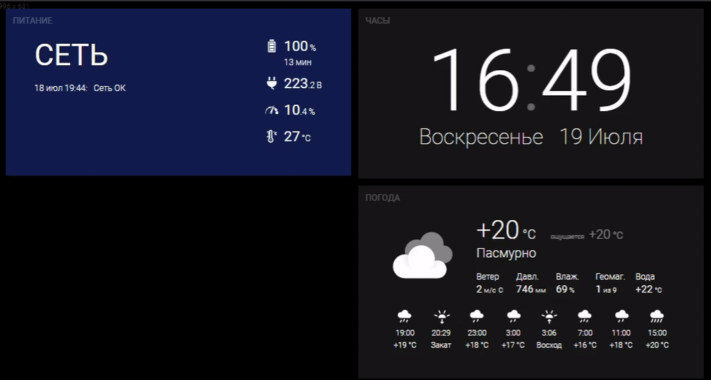
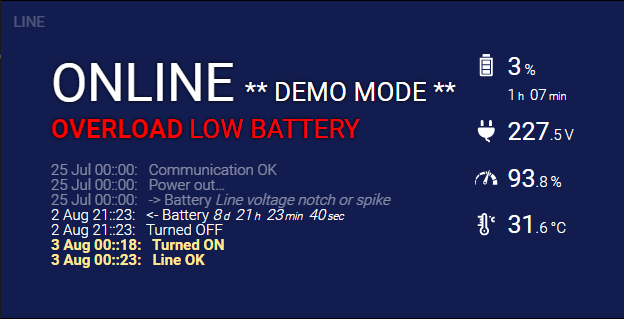
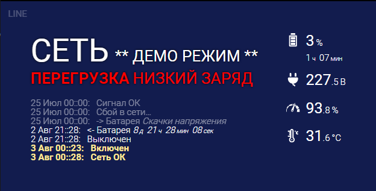
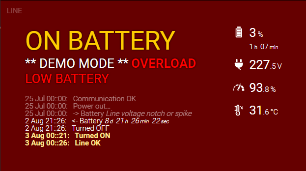
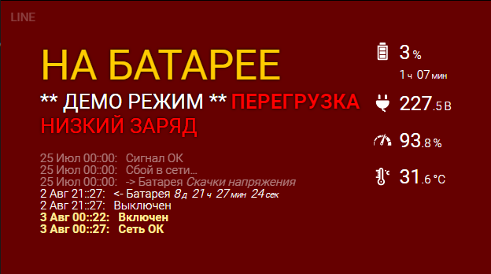

# Vue UPS

Lightweight Vue component UPS widget for responsive realtime monitoring.

## Requirements

* vue
* vue-i18n
* https://github.com/io-developer/prom-apcupsd-exporter

## Setting up

Please see `public/index.html`.

Component supports:

* Locale: en, ru
* Demo mode
* Websocket, timeouts and etc.

## In action on Pad

## Locales in Demo mode

Online [EN]:

Online [RU]:

On battery [EN]:

On battery [RU]:

